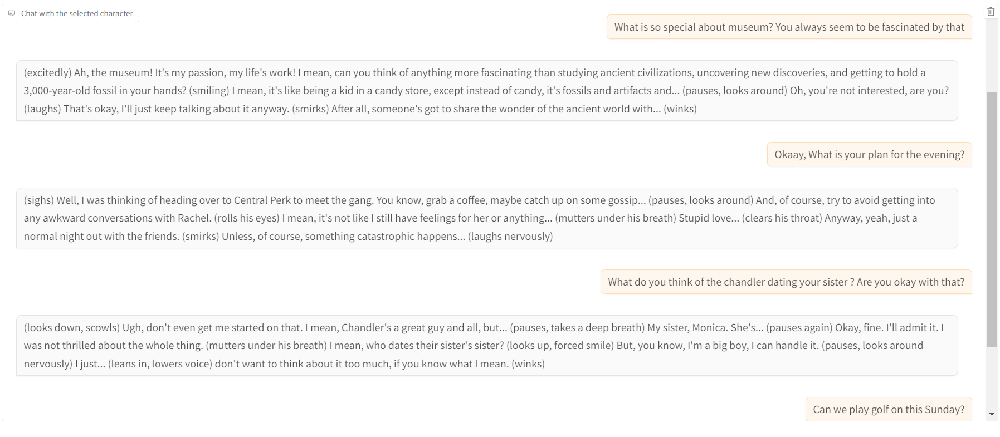

# **Friends_Chatbot_Conversational_AI_and_Character_Network_Insight**

## Introduction
This project focuses on developing an interactive chatbot that allows users to engage with characters from the Friends TV show, leveraging web-scraped transcripts and subtitles from 220 episodes. It incorporates a character network visualization to depict relationships and prominence, utilizing tailored models for real-time interactions. The solution enhances user experience by providing immersive and dynamic engagement with the iconic series.

## Key Features
- **Data Scraping:** Web scraped transcripts and subtitles of **220 episodes** of **Friends TV show**, exporting to XLSX format and conducting data cleaning to enhance dialogue quality.
- **Model Fine-Tuning:** Fine-tuned the **LLaMA-3** 8B model with BitsAndBytes for 4-bit quantization and applied **LoRA** for parameter-efficient fine-tuning, developing character-specific models and deploying them on Hugging Face using PyTorch and **Hugging Face Transformers**.
- **Character Network Development:** Developed a character network visualizing character prominence and relationship strengths using SpaCy's **Named Entity Recognition** (NER) model, NetworkX, and Pyviz.
- **Interactive Chatbot Creation:** Created an **interactive chatbot** on Gradio that allows users to engage with selected Friends characters, achieving an approximate response time of **87 seconds** and enhancing user experience through real-time interaction, including interactions with the developed character network. 
  - **[Click Here](link_to_your_streamlit_app)**

## Functionalities

**Character Insight**
- Character Insight Network Graph with details depicitng strength of the realtionship 
 

**Chatbot Interactive Screen:**
- Chat with your favourite Character.  
  

